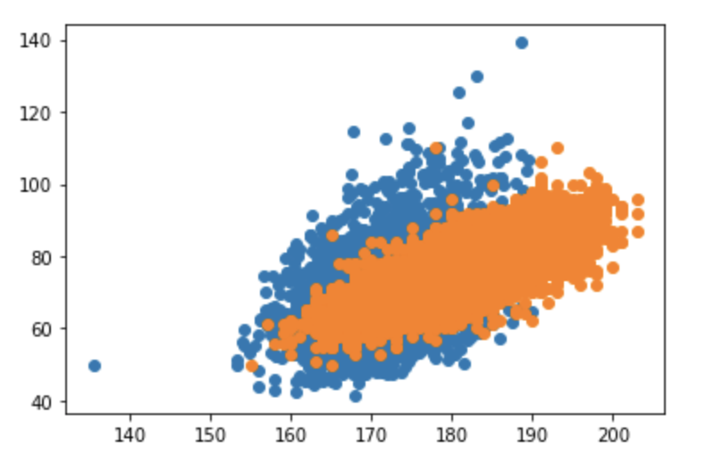

# 축구선수 탐지기

## 데이터 전처리

* 데이터는 FIFA15 데이터와 한국인 6000명 데이터를 사용하였다.
* 두 데이터 셋에서 남성의 키, 몸무게 수치를 리스트 형태로 변환하여 사용하였다.
* [FIFA15 데이터](./players_15_csv)
* [한국인 6000명 데이터](./2015_7_data.xlsx)

### 데이터 불러오기
~~~
import pandas as pd

# 데이터 불러오기
data = pd.read_excel('./2015_7_data.xlsx', usecols = 'A,R,AT')
data_fifa = pd.read_csv('players_15.csv')
~~~

### 한국인 6000 명 데이터 처리

* 데이터 프레임의 열 이름을 변경하였다.
* 남성 데이터로 구성시켰다. 
* 키 값에 10을 나눠 수정을 진행하였다.
* 판다스의 데이터 프레임 형태를 리스트로 변환시켰다.

~~~
# 열 이름 변경
data = data.rename({'ⓞ_02_성별':'sex', '①_003_키':'height', '①_031_몸무게':'weight'}, axis='columns')

# 남자 데이터로 구성
data_male = (data['sex']=='남')
data= data[data_male]

# 키 값 수정
data['height'] = data['height']/10

# 리스트로 변환
height = data['height'].values.tolist()
weight = data['weight'].values.tolist()
~~~

### FIFA15 축구선수 데이터 처리

* 데이터 셋에서 키 값만 추출하여 리스트로 변환하였다.
* 데이터 셋에서 몸무게 값만 추출하여 리스트로 변환하였다.

~~~
height_fifa = data_fifa['height_cm'].values.tolist()
weight_fifa = data_fifa['weight_kg'].values.tolist()
~~~

## 산점도 그리기

* 데이터의 분포를 시각적으로 살펴보기 위해 산점도를 그린다.

~~~
# 산점도 그리기
from matplotlib import pyplot as plt

plt.scatter(height, weight)
plt.scatter(height_fifa, weight_fifa)
~~~

### 산점도 결과

* 산점도를 살펴봤을 때 키와 몸무게 특성에 대한 일반인과 축구선수의 뚜렸한 차이는 보이지 않는다. 
* 두 부류가 명확이 나뉘지 않았기 때문에 새로운 특성을 예측하는 것이 의미가 없을 가능성이 크다.

## k 최근접 이웃 모델링

### 모델링을 위한 데이터 전처리

* 축구선수 데이터의 경우 6000개가 넘고 한국인 데이터의 경우 3000개가 넘기 때문에 랜덤 추출을 시행한다.
* 랜덤 추출의 수는 random_num 변수를 통해 조절한다.

~~~
random_num = 612
neighbors_num = 49

import random

# 데이터 랜덤 추출
height_random = random.sample(height, random_num)
weight_random = random.sample(weight, random_num)

height_fifa_random = random.sample(height_fifa, random_num)
weight_fifa_random = random.sample(weight_fifa, random_num)

# 일반인, 축구선수 데이터 합치기
height_total = height_random+height_fifa_random
weight_total = weight_random+weight_fifa_random
~~~

* 일반인과 축구 선수의 키, 몸무게 데이터를 각각 더한 후 2차원 리스트 형태로 만든다.
* 일반인의 경우 0, 축구선수인 경우 1 값을 두어 정답 데이터 리스트를 만든다.

~~~
# 키, 몸무게 데이터를 2차원 리스트로 생성
people_data = [[h, w] for h, w in zip(height_total, weight_total)]

# 정답 데이터 리스트 생성
people_target = [0]*random_num + [1]*random_num
~~~

### k 최근접 이웃 알고리즘 적용

* 객체를 생성한 후 fit 메서드를 통해 훈련 시킨다.
* predict 메서드를 통해 키 177이며 몸무게가 80인 남성의 데이터를 통해 축구 선수 판별을 예측한다. 
* 정확도의 경우 비교하는 데이터 수(random_num)와 KNeighborsClassifier의 매개변수인 n_neighbors(neighbors_num)를 바꾸어 가면서 높였다. 몇번의 시도 결과 random_num=612, neighbors_num=49 로 설정하여 정확도 0.812..로 맞추게 되었다.

~~~
from sklearn.neighbors import KNeighborsClassifier

# 객체 생성
kn = KNeighborsClassifier(n_neighbors=neighbors_num)

# 훈련
kn.fit(people_data, people_target)

# 예측
kn.predict([[180, 80]])

## 정확도 -> 0.812...
kn.score(people_data, people_target)
~~~

## 한계점

* 데이터 사용에 있어서 여러 문제점이 존재했다. 랜덤 추출을 하긴 했지만 데이터 크기 차이가 3000 정도 났다. 
* 축구선수 데이터의 경우 FIFA에 등록된 다양한 국적의 사람들이었고 일반인 데이터의 경우 한국인 대상이었기 때문에 한국인과 FIFA에 등록된 축구선수와의 비교만 가능하다.
* 산점도를 통해서도 알 수 있듯이 두 부류의 뚜렷한 차이가 보이지 않았다. 일반 남성의 경우도 키가 크고 무게가 적당한 사람들도 많이 때문에 단지 두 가지 특성만을 통해서 일반인과 축구선수를 분류하는 것이 처음부터 잘 못 되었을 가능성이 있다.
* 3000개가 넘는 모든 데이터를 사용할 수 없었다. 일정 크기가 넘으면 오류가 발생했다.

